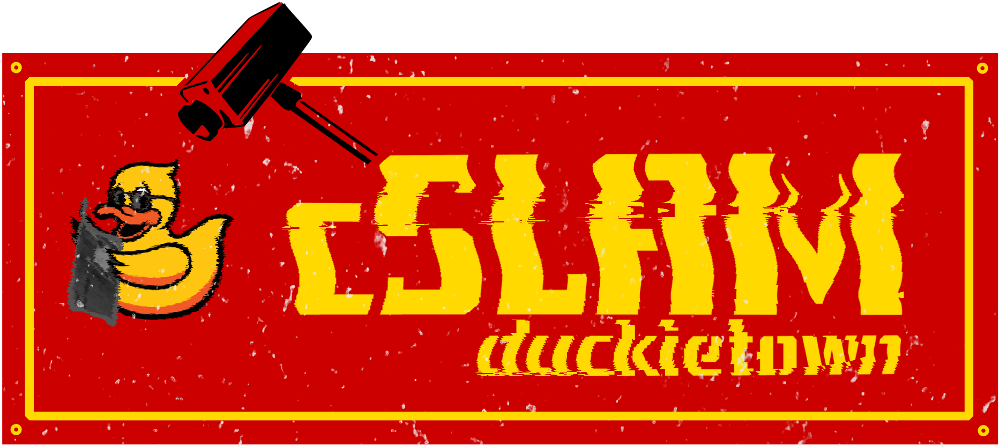

<div figure-id="fig:cslam_logo">
     
</div>

[](https://circleci.com/gh/duckietown/duckietown-cslam)

[](https://coveralls.io/github/duckietown/duckietown-cslam?branch=master18)

<!-- [](https://pypi.python.org/pypi/duckietown_cslam/) -->

<!-- [](https://pypi.python.org/pypi/duckietown_cslam/) -->

# Demo Instructions

Step-by-step instructions for a Robotarium demo of the cSLAM pipeline can be found on the official Duckietown documentation [here](http://docs.duckietown.org/DT18/opmanual_duckiebot/out/demo_cslam.html).

# cSLAM

It can be incredibly useful to have a system that can localize your Duckiebot. Not only in case you lose it, but also if you want to facilitate autonomous Robotarium operations or to evaluate AIDO submissions. And most importantly, it looks cool! And that's exactly what the cSLAM system does.

The goal of cSLAM is to fuse the observations of watchtowers and Duckiebots in a single optimization that tries to predict as accurately as possible the current and past Duckiebot locations. This is then nicely visualized on a 3D model of the city.

cSLAM was designed such that it is modular, scalable, and with minimum overhead on the Duckiebots. It is a complex system, so modular means that you will need to run quite a few Docker containers. On the other hand, it is easy to support and extend. And don't worry, we've automated the bulk of container work. Scalable means that it can easily be extended to large cities. As the system is modular, the processing can be distributed over more computers as a city grows. Finally, the minimum overhead means that we don't run any special code on the Duckiebots, we only expect them to publish image and odometry data. All the processing is offloaded to a computer.

At the core of cSLAM is a pose graph optimization problem. The watchtowers observe AprilTags on the ground, on top of Duckiebots and even on traffic signs. They can then estimate the relative pose of these AprilTags. Duckiebots similarly see tags on the ground and on traffic signs and estimate relative poses. Duckiebots also estimate their own pose relative to their past position by using odometry data. All these poses, together with the times when they were observed, are combined in a graph optimization problem that is solved by a library called [g2o](https://github.com/RainerKuemmerle/g2o). The solution to this problem is the global positions of all the observed AprilTags, and consequently of the Duckiebots.

<div figure-id="fig:architecture" figure-caption="Architecture of cSLAM.">
     
</div>

As can be seen from the above image there are quite a few devices and containers involved in this demo. Every red box is a physical device; every blue box is a Docker container that can be deployed on a different device. Let's see what the different containers are and what they do:

* The *acquisition containers* are multiple Docker containers, each being responsible for acquiring the raw data from a single robot (watchtower or Duckiebot), processing it (rectifying, April tag pose extraction, odometry calculation), and packaging the processed data as new topics on the Graph optimization ROS Master.

    Using separate containers allow us to scale the system to an almost infinite amount of robots and watchtowers (simply run as many nodes as necessary on a docker swarm). In this demo, we will run the acquisition containers for watchtowers on the towers themselves as this reduces the network delays in the system. The acquisition containers for Duckiebots, however, will be executed on a laptop such that the Duckiebot's computational resources are available for other processes.

* The *Graph optimizer* container aggregates all the AprilTag and odometry information, builds a pose graph out of it, and optimizes this graph. Then it publishes global pose information for all AprilTags and cameras in the system, which includes the positions of Duckiebots, watchtowers, traffic signs, and ground tags.

* The *Visualization* container presents the results of the graph optimization in a human- (and duckie-) friendly interface. It reads the positions of the various objects from the Graph optimizer container and shows them on a 3D map of the city.

* The *Diagnostics* container constantly probes the AprilTag pose and odometry messages that are being published and signals if a device stops publishing. This is useful to detect network or configuration issues.


## Prerequisite

3 packages (`acquisition_node`, `pose_graph_builder` and `cslam_visualization`) will be required to be built for centralized slam to work, and a `cslam_diagnostics` package to provide diagnostics on the message status between the devices and modules for troubleshooting.

If the default configurations are sufficient, follow the Demo instructions here (https://docs.duckietown.org/DT18/opmanual_duckiebot/out/demo_cslam.html)

If customization is required, source files can be modified and built from source, and/or configuration`.yml` files can be edited before running. The following describe each of the packages in greater detail.


## cSLAM acquision_node package

The cSLAM data acquisition node is the part that connects to the edge devices (Duckiebots or watchtowers), processes their data (rectifies images and extracts april tag poses) and forwards this information to the ROS Master where the graph optimizer picks it from. The acquisition node is designed to run as a Docker container, with one container responsible for a single device. This allows for easy load distribution across multiple devices.

### Prerequisites
To build and run the container you need to have Docker install. We recommend updating to the latest version. Testing was performed with version 18.06.1. In order to quickly launch containers for more than one device, we recommend using `docker-compose` and the provided `.yml` templates. Your `docker-compose` should work with Version 3 configuration files. When in doubt, make sure you have the latest version. We tested with 1.23.1 and 1.23.2.

Make sure that all your devices (Duckiebots, watchtowers, computers running the acquisition nodes and computers running the graph optimization node) are on the same local network and can discover each other.

### How to use the acquisition node?

You can either build the container locally with the provided Dockerfile or pull it directly from `duckietown/cslam-acquisition`.

The container operations depend on a number of parameters you need to supply as environmental variables. Here is a list of these. Note that you always need to supply the variables in italics. The rest will assume the values in this table, unless you specify otherwise.

| **Variable**                   	| **Example/Default**          	| **Explanation**                                                                                                                                                                                                                                                                                                                                                                                                             	|
|--------------------------------	|------------------------------	|-----------------------------------------------------------------------------------------------------------------------------------------------------------------------------------------------------------------------------------------------------------------------------------------------------------------------------------------------------------------------------------------------------------------------------	|
| *`ACQ_ROS_MASTER_URI_DEVICE`*    	| *`watchtower05.local`*       	| Hostname of the device whose data this container will be processing. This should be a Duckiebot or watchtower.                                                                                                                                                                                                                                                                                                              	|
| *`ACQ_ROS_MASTER_URI_DEVICE_IP`* 	| *`192.168.1.48`*             	| IP address of this device                                                                                                                                                                                                                                                                                                                                                                                                   	|
| `ACQ_ROS_MASTER_URI_DEVICE_PORT` 	| `11311`                      	| Port of the ROS Master on this device                                                                                                                                                                                                                                                                                                                                                                                       	|
| *`ACQ_ROS_MASTER_URI_SERVER`*    	| *`mycomputer.local`*         	| Hostname of the device doing the graph optimization, or the device that hosts the ROS Master of the graph optimization node.                                                                                                                                                                                                                                                                                                	|
| *`ACQ_ROS_MASTER_URI_SERVER_IP`* 	| *`192.168.1.85`*             	| IP address of this device                                                                                                                                                                                                                                                                                                                                                                                                   	|
| `ACQ_ROS_MASTER_URI_SERVER_PORT` 	| `11311`                      	| Port of the ROS Master on this device                                                                                                                                                                                                                                                                                                                                                                                       	|
| *`ACQ_DEVICE_NAME`*              	| *`watchtower05`*             	| ROS name of the device whose data this container will be processing. All topics published by this device are assumed to be of the form `/ACQ_DEVICE_NAME/topic_name`                                                                                                                                                                                                                                                        	|
| `ACQ_POSES_UPDATE_RATE`                	| `10`                          	| This is the frequency of image processing and april tag extraction. Higher values are recommended for performance but need more computational resources.                                                                                                                                                                                                                                                                    	|
| `ACQ_ODOMETRY_UPDATE_RATE`                	| `30`                          	| This is the frequency of odometry data processing and publishing. Higher values are recommended for performance but need more computational resources and are more susceptible to noise.                                                                                                                                                                                                                                                                    	|
| `ACQ_STATIONARY_ODOMETRY`                	| `0`                          	| Boolean, `1` or `0`. If set to `1` will also publish odometry relative poses (equal to zero) when the device doesn't send odometry data (always for a watchtower or when not moving for a Duckiebot                                        	|
| `ACQ_TEST_STREAM`                	| `1`                          	| Boolean, `1` or `0`. If set to `1` will also publish the raw, rectified and info streams to the ACQ_ROS_MASTER_URI_SERVER                                                                                                                                                                                                                                                                                                   	|
| `ACQ_BEAUTIFY`                   	| `1`                          	| Boolean, `1` or `0`. If set to `1` will attempt to automatically improve the contrast of the raw image.                                                                                                                                                                                                                                                                                                                     	|
| `ACQ_TOPIC_RAW`                 	| `camera_node/image/raw`      	| Topic name for the raw image stream of the device whose data this container will be processing                                                                                                                                                                                                                                                                                                                              	|
| `ACQ_TOPIC_CAMERAINFO`           	| `camera_node/camera_info`    	| Topic name for the camera information stream of the device whose data this container will be processing                                                                                                                                                                                                                                                                                                                     	|
| `ACQ_TOPIC_VELOCITY_TO_POSE`     	| Not set or `velocity_to_pose_node/pose` 	| Topic name for the odometry pose stream of the device whose data this container will be processing (meaningful only for Duckiebots)                                                                                                                                                                                                                                                                                         	|
| `ACQ_TAG_SIZE`                   	| `0.065`                      	| April tag size in meters                                                                                                                                                                                                                                                                                                                                                                                                    	|
| `ACQ_POSES_TOPIC`                	| `poses`                      	| Name for the relative poses topic on `ACQ_ROS_MASTER_URI_SERVER`                                                                                                                                                                                                                                                                                                                                                              	|
| `ACQ_ODOMETRY_TOPIC`             	| `odometry`                   	| Name for the odometry poses topic on `ACQ_ROS_MASTER_URI_SERVER`                                                                                                                                                                                                                                                                                                                                                              	|

The easiest way to get started is to edit one of the example `.yml` files provided. Note that if you run the container directly (without a docker-compose file), then you need to pass the `--network host` parameter.

Before starting the container make sure your devices are publishing the necessary topics (at least raw images and camera information, optionally odometry information). For example:
- Robotarium watchtowers without Docker: `ssh` in the watchtower and run:
  ```
  cd duckietown
  git checkout devel-auto-localization-system-calibration
  make auto_localization_watchtower
  ```
- DT18 Duckiebots or watchtowers with Docker: make sure the following containers are running
  - `roscore` (`duckietown/rpi-ros-kinetic-roscore:master18`)
  - `ros-picam` (`duckietown/rpi-duckiebot-ros-picam:master18`)
  - `joystick` (`duckietown/rpi-duckiebot-joystick-demo:master18`) (*Only for the Duckiebots*)

Also check that `roscore` is running on the `ACQ_ROS_MASTER_URI_SERVER` device.

Once all that is done you can start all the containers set up in the `.yml` file with:
```
docker-compose -f docker-compose-file.yml up
```
Now, if everything is running smoothly you will start receiving data on the ROS Master on `ACQ_ROS_MASTER_URI_SERVER`.

## cSLAM pose_graph_builder package

The cSLAM pose_graph_builder package will generates a graph, where the vertices represents all the AprilTags in the environment and the edges represents the transforms between the AprilTag. The error of the position of a vertex in a time instance within the graph will be reduced by adjusment of the parameters of the transforms that is represented as an edge.

### Prerequisites

Install g2opy (https://github.com/uoip/g2opy ) on the computer that runs the graph part.

Warning : you will need to run  `cmake -DPYBIND11_PYTHON_VERSION=2.7 ..` to have it build for python2

### Building and running an example

To build and run an example of the pose_graph_builder package, do this :

    $ cd lib-cslam
    $ python setup.py develop --no-deps --user
    $ cd ../ros-cslam
    $ catkin_make install
    $ source devel/setup.bash
    $ roslaunch pose_graph_builder test.launch

This will launch a dummy publisher that publishes the messages of the relative poses of 6 Duckiebots randomly.  
The transform_listener_ros.py will listen to the messages, and create a graph using duckietown_graph_builder (that itself uses g2o_graph_builder, both are in lib-cslam)

To launch the listener, do:  
    $ roslaunch pose_graph_builder transform_listener.launch

To visualize, run rviz on another terminal, add the topic type TF. Et voilà!  


## cSLAM_visualization package


## cSLAM_diagnostics package

The cSLAM_diagnostics package will check that the messaging status between the devices and packages are received within a time period, else an ERROR status will be shown for the message. If a message is expected to be observed and is not seen by the diagnostics tool, it could mean that there were issues with the transmission of the message out or that the AprilTags were not recognized.

### Prerequisites

Install python-qt4

### Building and running

    $ source /opt/ros/kinetic/setup.bash
    $ cd /duckietown-cslam/src
    $ catkin_make
    $ source /duckietown-cslam/devel/setup.bash
    $ rosrun cslam_diagnostics cslam_diagnostics_node.py

An interface will appear with the tab AprilTag and Odometry to view the devices that are sending these messsages.
